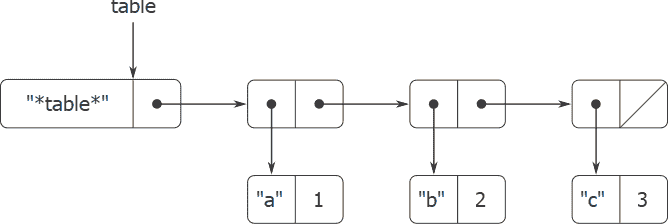
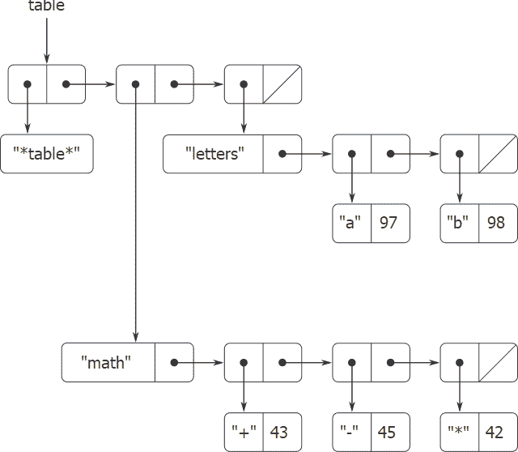

# 3.3.3代表表

> 译者： [https://sicp.comp.nus.edu.sg/chapters/60](https://sicp.comp.nus.edu.sg/chapters/60)

当我们在第2章研究了各种表示集的方式时，我们在 [2.3.3](37)[2.4.3](42) 部分中的数据定向编程的实现中，我们广泛使用了二维表，其中使用两个键来存储和检索信息。 在这里，我们看到了如何将表构建为可变列表结构。

我们首先考虑一维表，其中每个值都存储在单个键下。 我们将表实现为记录列表，每个记录都实现为由键和相关值组成的一对。 记录通过`head`指向连续记录的对粘在一起形成一个列表。 这些胶合对称为表的_主干_。 为了在向表中添加新记录时可以更改位置，我们将表构建为_标题列表_。 带有头的列表的开头有一个特殊的主干对，该主干对包含一个虚拟的&lt;quote&gt;记录&lt;/quote&gt;-在这种情况下为任意选择的字符串`"*table*"`。 图 [3.22](60#fig_3.22) 显示了表的框和指针图

```js
a: 1
b: 2
c: 3
```

 <split><figure>**[Figure 3.22](60#fig_3.22)** A table represented as a headed list.</figure></split> 

要从表中提取信息，我们使用`lookup`函数，该函数将键作为参数并返回关联的值（如果该键下没有存储任何值，则返回false）。 函数`lookup`是根据`assoc`操作定义的，该操作需要键和记录列表作为参数。 请注意，`assoc`永远不会看到虚拟记录。 函数`assoc`返回具有给定键作为其`head`的记录。 &lt;split&gt;[[1]](60#footnote-1)&lt;/split&gt; 然后，函数`lookup`检查以查看`assoc`返回的结果记录是否为假，并返回记录的值（`tail`） 。

```js
function lookup(key, table) {
    const record = assoc(key, tail(table));
    return record === undefined
           ? undefined
           : tail(record);
}
```

```js
function assoc(key, records) {
    return is_null(records)
           ? undefined
           : is_equal(key, head(head(records)))
             ? head(records)
             : assoc(key, tail(records));
}
```

要在指定键下的表中插入值，我们首先使用`assoc`查看表中是否已经有使用该键的记录。 如果不是，我们通过`pair`将键和值一起形成一个新记录，并将其插入到表的记录列表的开头，在虚拟记录之后。 如果已经有一个带有此键的记录，我们将该记录的`tail`设置为指定的新值。 该表的标题为我们提供了一个固定的位置，可以进行修改以插入新记录。 [[2]](60#footnote-2)

```js
function insert(key, value, table) {
    const record = assoc(key, tail(table));
    return record === undefined
           ? set_tail(table, pair(pair(key, value),
                                  tail(table)))
           : set_tail(record, value);
}
```

要构造一个新表，我们只需创建一个包含符号`*table*`的列表：

```js
function make_table() {
    return list("*table*");
}
```

## 二维表

在二维表中，每个值由两个键索引。 我们可以将这样的表构造为一维表，其中每个键都标识一个子表。 图 [3.23](60#fig_3.23) 显示了表的框和指针图

```js
math:
    +:  43
    -:  45
    *:  42
letters:
    a:  97
    b:  98
```

which has two subtables. (The subtables don't need a special header symbol, since the key that identifies the subtable serves this purpose.) <split><figure>**[Figure 3.23](60#fig_3.23)** A two-dimensional table.</figure></split> 

查找项目时，我们使用第一个键来识别正确的子表。 然后，我们使用第二个键来标识子表中的记录。

```js
function lookup(key_1, key_2, table) {
    const subtable = assoc(key_1, tail(table));
    if (subtable === undefined) {
        return undefined;
    } else {
        const record = assoc(key_2, tail(subtable));
        if (record === undefined) {
            return undefined;
        } else {
            return tail(record);
        }
    }
}
```

要在一对键下插入新项目，我们使用`assoc`来查看第一个键下是否存储有子表。 如果没有，我们将建立一个包含单个记录（`key_2`，`value`）的新子表，并将其插入到表的第一个键下。 如果第一个键的子表已经存在，则使用上述一维表的插入方法，将新记录插入到该子表中：

```js
function insert(key_1, key_2, value, table) {
    const subtable = assoc(key_1, tail(table));
    if (subtable === undefined) {
        set_tail(table,
                 pair(list(key_1, pair(key_2, value)),
                      tail(table)));
    } else {
        const record = assoc(key_2, tail(table));
        if (record === undefined) {
            set_tail(subtable,
                     pair(pair(key_2, value),
                          tail(subtable)));
        } else {
            set_tail(record, value);
        }
    }
}
```

## 创建本地表

上面定义的`lookup`和`insert`操作将表作为参数。 这使我们能够使用访问多个表的程序。 处理多个表的另一种方法是为每个表分别使用`lookup`和`insert`函数。 我们可以通过将表作为过程的对象来表示，该对象将内部表作为其局部状态的一部分进行维护。 当发送适当的消息时，此&lt;quote&gt;表对象&lt;/quote&gt;提供用于对内部表进行操作的功能。 这是以这种方式表示的二维表的生成器：

```js
function make_table() {
    const local_table = list("*table*");
    function lookup(key_1, key_2) {
        const subtable = assoc(key_1, tail(local_table));
        if (subtable === undefined) {
            return undefined;
        } else {
            const record = assoc(key_2, tail(subtable));
            if (record === undefined) {
                return undefined;
            } else {
                return tail(record);
            }
        }
    }
    function insert(key_1, key_2, value) {
        const subtable = assoc(key_1, tail(local_table));
        if (subtable === undefined) {
            set_tail(local_table,
                     pair(list(key_1, pair(key_2, value)),
                          tail(local_table)));
        } else {
            const record = assoc(key_2, tail(subtable));
            if (record === undefined) {
      	        set_tail(subtable,
	                       pair(pair(key_2, value),
                              tail(subtable)));
	    } else {
                set_tail(record, value);
            }
        }
    }
    function dispatch(m) {
        return m === "lookup"
               ? lookup
               : m === "insert"
                 ? insert
                 : "undefined operation -- table";
    }
    return dispatch;
}
```

使用`make_table`，我们可以实现 [2.4.3](42) 部分中用于数据定向编程的`get`和`put`操作，如下所示：

```js
const operation_table = make_table();
const get = operation_table("lookup");
const put = operation_table("insert");
```

函数`get`以两个键作为参数，而`put`以两个键和一个值作为参数。 这两个操作都访问同一个本地表，该本地表封装在通过`make_table`调用创建的对象中。

<exercise>In the table implementations above, the keys are tested for equality using `is_equal` (called by `assoc`). This is not always the appropriate test. For instance, we might have a table with numeric keys in which we don't need an exact match to the number we're looking up, but only a number within some tolerance of it. Design a table constructor `make_table` that takes as an argument a `same_key` function that will be used to test <quote>equality</quote> of keys. The function `make_table` should return a `dispatch` function that can be used to access appropriate `lookup` and `insert` functions for a local table.<button class="btn btn-secondary solution_btn" data-toggle="collapse" href="#no_solution_60_1_div">Add solution</button>There is currently no solution available for this exercise. This textbook adaptation is a community effort. Do consider contributing by providing a solution for this exercise, using a Pull Request in [Github](https://github.com/source-academy/sicp).</exercise><exercise>Generalizing one- and two-dimensional tables, show how to implement a table in which values are stored under an arbitrary number of keys and different values may be stored under different numbers of keys. The `lookup` and `insert` functions should take as input a list of keys used to access the table.<button class="btn btn-secondary solution_btn" data-toggle="collapse" href="#no_solution_60_1_div">Add solution</button>There is currently no solution available for this exercise. This textbook adaptation is a community effort. Do consider contributing by providing a solution for this exercise, using a Pull Request in [Github](https://github.com/source-academy/sicp).</exercise><exercise>To search a table as implemented above, one needs to scan through the list of records. This is basically the unordered list representation of section <ref name="sec:representing-sets">[2.3.3](37)</ref>. For large tables, it may be more efficient to structure the table in a different manner. Describe a table implementation where the (key, value) records are organized using a binary tree, assuming that keys can be ordered in some way (e.g., numerically or alphabetically). (Compare exercise <ref name="ex:set-lookup-binary-tree">[2.66](37#ex_2.66)</ref> of chapter 2.)<button class="btn btn-secondary solution_btn" data-toggle="collapse" href="#no_solution_60_1_div">Add solution</button>There is currently no solution available for this exercise. This textbook adaptation is a community effort. Do consider contributing by providing a solution for this exercise, using a Pull Request in [Github](https://github.com/source-academy/sicp).</exercise><exercise>_Memoization_ (also called _tabulation_) is a technique that enables a function to record, in a local table, values that have previously been computed. This technique can make a vast difference in the performance of a program. A memoized function maintains a table in which values of previous calls are stored using as keys the arguments that produced the values. When the memoized function is asked to compute a value, it first checks the table to see if the value is already there and, if so, just returns that value. Otherwise, it computes the new value in the ordinary way and stores this in the table. As an example of memoization, recall from section <ref name="sec:tree-recursion">[1.2.2](13)</ref> the exponential process for computing Fibonacci numbers:

```js
function fib(n) {
    return n === 0
           ? 0
           : n === 1
             ? 1
             : fib(n - 1) + fib(n - 2);
}
```

The memoized version of the same function is

```js
const memo_fib = memoize(n => n === 0
                              ? 0
                              : n === 1
                                ? 1
                                : memo_fib(n - 1) +
                                  memo_fib(n - 2)
                        );
```

where the memoizer is defined as

```js
function memoize(f) {
    const table = make_table();
    return x => {
        const previously_computed_result 
            = lookup(x, table);
        if (previously_computed_result === undefined) {
            const result = f(x);
            insert(x, result, table);
            return result;
        } else {
            return previously_computed_result;
        }
    };
}
```

Draw an environment diagram to analyze the computation of `memo_fib(3)`. Explain why `memo_fib` computes the th Fibonacci number in a number of steps proportional to . Would the scheme still work if we had simply defined `memo_fib` to be `memoize(fib)`?<button class="btn btn-secondary solution_btn" data-toggle="collapse" href="#no_solution_60_1_div">Add solution</button>There is currently no solution available for this exercise. This textbook adaptation is a community effort. Do consider contributing by providing a solution for this exercise, using a Pull Request in [Github](https://github.com/source-academy/sicp).</exercise>

* * *

[[1]](60#footnote-link-1) Because `assoc` uses `is_equal`, it can recognize keys that are strings, numbers, or list structure.

[[2]](60#footnote-link-2) Thus, the first backbone pair is the object that represents the table <quote>itself</quote>; that is, a pointer to the table is a pointer to this pair. This same backbone pair always starts the table. If we did not arrange things in this way, `insert` would have to return a new value for the start of the table when it added a new record.

