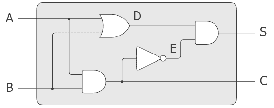
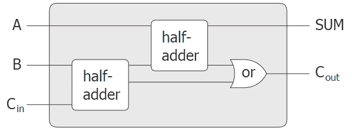

# 3.3.4数字电路仿真器

> 译者： [https://sicp.comp.nus.edu.sg/chapters/61](https://sicp.comp.nus.edu.sg/chapters/61)

设计复杂的数字系统（例如计算机）是一项重要的工程活动。 数字系统是通过互连简单元素而构建的。 尽管这些单个元素的行为很简单，但是它们的网络可能具有非常复杂的行为。 拟议中的电路设计的计算机仿真是数字系统工程师使用的重要工具。 在本节中，我们设计用于执行数字逻辑仿真的系统。 该系统代表了一种称为_事件驱动的仿真_的程序，其中的动作（&lt;quote&gt;事件&lt;/quote&gt;）触发了以后发生的其他事件，进而触发了更多事件，并且 一般般。

我们的电路计算模型将由与构成电路的基本组件相对应的对象组成。 _线_带有_数字信号_。 数字信号随时可能只有两个可能的值0和1之一。还有各种类型的数字_功能盒_，它们将承载输入信号的线连接到其他输出线。 这样的盒子产生根据它们的输入信号计算出的输出信号。 输出信号的延迟时间取决于功能盒的类型。 例如，_逆变器_是一种原始功能盒，可将其输入反转。 如果逆变器的输入信号变为0，则一台_逆变器延迟_之后，逆变器会将其输出信号更改为1。如果逆变器的输入信号变为1，则一台_逆变器 -延迟_之后，逆变器会将其输出信号更改为0。我们象征性地绘制了逆变器，如图 [3.24](61#fig_3.24)[3.24](61#fig_3.24) 所示，是一种具有两个输入和一个输出的基本功能框。 它将其输出信号驱动为逻辑_和输入_的值。 也就是说，如果两个输入信号都变为1，则_和门延迟_次之后，“与”门将迫使其输出信号为1； 否则，输出将为0。_或门_是类似的两输入原语功能盒，可将其输出信号驱动为输入的_逻辑或_值。 也就是说，如果至少一个输入信号为1，则输出将变为1；否则，输出将变为1。 否则输出将变为0。

<figure>**[图3.24](61#fig_3.24)** 数字逻辑模拟器中的原始函数。</figure>

我们可以将原始函数连接在一起以构造更复杂的函数。 为此，我们将某些功能盒的输出连接到其他功能盒的输入。 例如，图 [3.25](61#fig_3.25) 中所示的_半加法器_电路由一个或门，两个与门和一个反相器组成。 它需要两个输入信号A和B，以及两个输出信号S和C.只要A和B之一精确为1，S就会为1，而当A和B都为1时C就会为1。 从图中可以看出，由于所涉及的延迟，可能会在不同时间生成输出。 这一事实导致了数字电路设计中的许多困难。

<figure>**[图3.25](61#fig_3.25)** 半加法器电路。</figure>

现在，我们将构建一个程序，用于对我们希望学习的数字逻辑电路进行建模。 该程序将构建对电线建模的计算对象，这些电线将&lt;quote&gt;保持&lt;/quote&gt;信号。 功能框将通过在信号之间建立正确关系的功能来建模。

模拟的一个基本要素是函数`make_wire`，该函数构造导线。 例如，我们可以构造六根导线，如下所示：

```js
const a = make_wire();
const b = make_wire();
const c = make_wire();
const d = make_wire();
const e = make_wire();
const s = make_wire();
```

通过调用构造这种类型的盒子的函数，我们将一个功能盒子连接到一组电线上。 构造函数的参数是连接到盒子的电线。 例如，假设我们可以构造与门，或门和逆变器，则可以将图 [3.25](61#fig_3.25) 中所示的半加法器连接在一起：

```js
or_gate(a, b, d);
```

```js
and_gate(a, b, c);
```

```js
inverter(c, e);
```

```js
and_gate(d, e, s);
```

更好的是，我们可以通过定义构造此电路的函数`half_adder`来明确命名该操作，给定要连接到半加法器的四根外部导线：

```js
function half_adder(a, b, s, c) {
    const d = make_wire();
    const e = make_wire();
    or_gate(a, b, d);
    and_gate(a, b, c);
    inverter(c, e);
    and_gate(d, e, s);
    return "ok";
}
```

进行此定义的好处是，我们可以将`half_adder`本身用作构建更复杂电路的基础。 图 [3.26](61#fig_3.26) 例如，显示由两个半加器和一个或门组成的_全加器_。 [[1]](61#footnote-1) 我们可以如下构建一个全加器：

```js
function full_adder(a, b, c_in, sum, c_out) {
    const s = make_wire();
    const c1 = make_wire();
    const c2 = make_wire();
    half_adder(b, c_in, s, c1);
    half_adder(a, s, sum, c2);
    or_gate(c1, c2, c_out);
    return "ok";
}
```

将`full_adder`定义为函数后，我们现在可以将其用作创建更复杂电路的构建块。 （例如，参见练习 [3.30](61#ex_3.30) 。）

<figure>**[图3.26](61#fig_3.26)** 全加法器电路。</figure>

本质上，我们的模拟器为我们提供了构建电路语言的工具。 如果我们在 [1.1](2) 部分中采用用于研究JavaScript的语言的一般观点，则可以说原始函数框构成了语言的原始元素，即 盒子一起提供了一种组合方式，将接线图指定为功能可以作为一种抽象方式。

## 原始功能框

基本功能框实现&lt;quote&gt;力&lt;/quote&gt;，通过该力，一根电线上的信号变化会影响另一根电线上的信号。 要构建功能盒，我们对电线使用以下操作：

*   `get_signal(wire)`：返回电线上信号的当前值。
*   `set_signal(wire, new_value)`：将电线上的信号值更改为新值。
*   `add_action(wire, nullary_function)`：断言，只要电线上的信号改变值，就应运行指定的功能。 这样的功能是通过车辆将电线上信号值的变化传达给其他电线的车辆。

此外，我们将利用需要延迟时间的函数`after_delay`和要运行的函数，并在给定的延迟后执行给定的函数。

使用这些功能，我们可以定义原始的数字逻辑功能。 为了通过逆变器将输入连接到输出，我们使用`add_action`与输入线关联一个功能，只要输入线上的信号改变值，该功能便会运行。 该函数计算输入信号的`logical_not`，然后在一个`inverter_delay`之后，将输出信号设置为此新值：

```js
function inverter(input, output) {
    function invert_input() {
        const new_value = logical_not(get_signal(input));
        after_delay(inverter_delay, 
                    () => set_signal(output, new_value));
    }
    add_action(input, invert_input);
    return "ok";
}

function logical_not(s) {
    return s === 0
           ? 1
           : s === 1
             ? 0
             : Error("Invalid signal for logical_not", s);
}
```

与门稍微复杂一点。 如果门的任何输入发生变化，则必须运行动​​作功能。 它计算输入导线上信号值的`logical_and`（使用类似于`logical_not`的函数），并设置一个新值，即在一个`and_gate_delay`之后出现在输出线上的新值的变化。

```js
function and_gate(a1, a2, output) {
    function and_action_function() {
        const new_value = logical_and(get_signal(a1),
                                    get_signal(a2));
        after_delay(and_gate_delay, 
                    () => set_signal(output, new_value);
    }
    add_action(a1, and_action_function);
    add_action(a2, and_action_function);
    return "ok";
}
```

<exercise>Define an or-gate as a primitive function box. Your `or_gate` constructor should be similar to `and_gate`.<button class="btn btn-secondary solution_btn" data-toggle="collapse" href="#no_solution_61_1_div">Add solution</button>There is currently no solution available for this exercise. This textbook adaptation is a community effort. Do consider contributing by providing a solution for this exercise, using a Pull Request in [Github](https://github.com/source-academy/sicp).</exercise><exercise>Another way to construct an or-gate is as a compound digital logic device, built from and-gates and inverters. Define a function `or_gate` that accomplishes this. What is the delay time of the or-gate in terms of `and_gate_delay` and `inverter_delay`?<button class="btn btn-secondary solution_btn" data-toggle="collapse" href="#no_solution_61_1_div">Add solution</button>There is currently no solution available for this exercise. This textbook adaptation is a community effort. Do consider contributing by providing a solution for this exercise, using a Pull Request in [Github](https://github.com/source-academy/sicp).</exercise><exercise>Figure <ref name="fig:ripple-carry">[3.27](61#fig_3.27)</ref> shows a _ripple-carry adder_ formed by stringing together  full-adders. This is the simplest form of parallel adder for adding two -bit binary numbers. The inputs , , , …,  and , , , …,  are the two binary numbers to be added (each  and  is a 0 or a 1). The circuit generates , , , …, , the  bits of the sum, and , the carry from the addition. Write a function `ripple_carry_adder` that generates this circuit. The function should take as arguments three lists of  wires each—the , the , and the —and also another wire . The major drawback of the ripple-carry adder is the need to wait for the carry signals to propagate. What is the delay needed to obtain the complete output from an -bit ripple-carry adder, expressed in terms of the delays for and-gates, or-gates, and inverters?<button class="btn btn-secondary solution_btn" data-toggle="collapse" href="#no_solution_61_1_div">Add solution</button>There is currently no solution available for this exercise. This textbook adaptation is a community effort. Do consider contributing by providing a solution for this exercise, using a Pull Request in [Github](https://github.com/source-academy/sicp).</exercise>

<figure>**[Figure 3.27](61#fig_3.27)** A ripple-carry adder for -bit numbers.</figure>

## 代表电线

在我们的仿真中，一条导线将是一个具有两个局部状态变量的计算对象：一个`signal_value`（最初为0）和一个在信号改变值时运行的`action_function`的集合。 我们使用消息传递样式将电汇作为局部函数的集合以及选择适当的局部操作的`dispatch`函数来实现，就像我们在 [部分中对简单银行帐户对象所做的一样 3.1.1](49) ：

```js
function make_wire() {
    let signal_value = 0;
    let action_functions = null;
    function set_my_signal(new_value) {
        if (signal_value !== new_value) {
            signal_value = new_value;
            call_each(action_functions);
        } else {}
    }
    function accept_action_function(fun) {
        action_functions = pair(fun, action_functions);
        fun();
    }
    function dispatch(m) {
        return m === "get_signal"
               ? signal_value
               : m === "set_signal"
                 ? set_my_signal
                 : m === "add_action"
                   ? accept_action_function
                   : Error("Unknown operation in wire", m);
    }
    return dispatch;
}
```

本地功能`set_my_signal`测试新的信号值是否改变了电线上的信号。 如果是这样，它将使用以下函数`call_each`运行每个动作函数，该函数调用无参数函数列表中的每个项目：

```js
function call_each(functions) {
    if (is_null(functions)) {
        return "done";
    } else {
        (head(functions))();
        call_each(tail(functions));
    }
}
```

本地功能`accept_action_function`将给定功能添加到要运行的功能列表中，然后运行一次新功能。 （请参阅练习 [3.31](61#ex_3.31) 。）

通过指定的本地`dispatch`功能设置，我们可以提供以下功能来访问电线上的本地操作： [[2]](61#footnote-2)

```js
function get_signal(wire) {
    return wire("get_signal");
}

function set_signal(wire, new_value) {
    return (wire("set_signal"))(new_value);
}

function add_action(wire, action_function) {
    return (wire("add_action"))(action_function);
}
```

电线具有随时间变化的信号，并且可能会逐步连接到设备，这是易变的对象的典型特征。 我们已将它们建模为具有通过赋值修改的局部状态变量的函数。 创建新线路时，将分配一组新的状态变量（通过`make_wire`中的`let`表达式），并构造并返回一个新的`dispatch`函数，并使用新的状态变量捕获环境。

电线在已连接的各种设备之间共享。 因此，通过与一个设备交互进行的更改将影响连接到导线的所有其他设备。 建立连接时，电线通过调用提供给它的动作功能将更改传达给它的邻居。

## 议程

完成模拟器所需的唯一内容是`after_delay`。 这里的想法是，我们维护一个称为_议程_的数据结构，其中包含要执行的工作的时间表。 为议程定义了以下操作：

*   `make_agenda()`：返回一个新的空白议程。
*   `is_empty_agenda(agenda)`：如果指定的议程为空，则为true。
*   `first_agenda_item(agenda)`：返回议程上的第一项。
*   `remove_first_agenda_item(agenda)`：通过删除第一项来修改议程。
*   `add_to_agenda(time, action, agenda)`：通过添加要在指定时间运行的给定动作功能来修改议程。
*   `current_time(agenda):`：返回当前仿真时间。

我们使用的特定议程由`the_agenda`表示。 函数`after_delay`向`the_agenda`添加了新元素：

```js
function after_delay(delay, action) {
    add_to_agenda(delay + current_time(the_agenda),
                  action, the_agenda);
}
```

仿真由功能`propagate`驱动，该功能在`the_agenda`上运行，依次执行议程上的每个功能。 通常，随着模拟的进行，新项目将添加到议程中，`propagate`将继续进行模拟，只要议程中有项目即可：

```js
function propagate() {
    if (is_empty_agenda(the_agenda)) {
        return "done";
    } else {
        const first = first_agenda_item(the_agenda);
        first();
        remove_first_agenda_item(the_agenda);
        return propagate();
    }
}
```

## 样本模拟

以下功能将&lt;quote&gt;探针&lt;/quote&gt;放置在电线上，显示了仿真器的运行情况。 该探针告诉电线，只要其信号改变值，它就应打印新的信号值，当前时间以及标识电线的名称：

```js
function probe(name, wire) {
    add_action(wire, 
               () => display(name + " " +
                             current_time(the_agenda) + 
                             ", New value = " + 
                             get_signal(wire));
}
```

我们首先初始化议程并为原始功能框指定延迟：

```js
const the_agenda = make_agenda();
const inverter_delay = 2;
const and_gate_delay = 3;
const or_gate_delay = 5;
```

现在我们定义了四根导线，在其中两根探针上放置了探针：

```js
const input_1 = make_wire();
const input_2 = make_wire();
const sum = make_wire();
const carry = make_wire();

probe("Sum", sum);
// Sum 0, New value = 0
```

```js
probe("Carry", carry);
// Carry 0, New value = 0
```

接下来，我们将导线连接到半加法器电路中（如图 [3.25](61#fig_3.25) ），将`input_1`上的信号设置为1，然后运行仿真：

```js
half_adder(input_1, input_2, sum, carry);
```

```js
set_signal(input_1, 1);
```

```js
propagate();
// Sum 8, New Value = 1
```

The `sum` signal changes to 1 at time 8. We are now eight time units from the beginning of the simulation. At this point, we can set the signal on `input_2` to 1 and allow the values to propagate:

```js
set_signal(input_2, 1);
```

```js
propagate();
// Carry 11, New value = 1
// Sum 16, New value = 0
```

`carry`在时间11更改为1，`sum`在时间16更改为0。

<exercise>The internal function `accept_action_function` defined in `make_wire` specifies that when a new action function is added to a wire, the function is immediately run. Explain why this initialization is necessary. In particular, trace through the half-adder example in the paragraphs above and say how the system's response would differ if we had defined `accept_action_function` as

```js
function accept_action_function(fun) {
    action_functions = pair(fun, action_functions);
}
```

<button class="btn btn-secondary solution_btn" data-toggle="collapse" href="#no_solution_61_1_div">Add solution</button>There is currently no solution available for this exercise. This textbook adaptation is a community effort. Do consider contributing by providing a solution for this exercise, using a Pull Request in [Github](https://github.com/source-academy/sicp).</exercise>

## 实施议程

最后，我们提供了议程数据结构的详细信息，该数据结构包含计划在将来执行的功能。

议程由_个时间段_组成。 每个时间段都是一对，其中包含一个数字（时间）和一个队列（请参阅练习 [3.32](61#ex_3.32) ），其中包含计划在该时间段内运行的功能。

```js
function make_time_segment(time, queue) {
    return pair(time, queue);
}

function segment_time(s) {
    return head(s);
}

function segment_queue(s) {
    return tail(s);
}
```

我们将使用 [3.3.2](59) 部分中描述的队列操作对时间段队列进行操作。

议程本身是一维时间段表。 它与 [3.3.3](60) 部分中描述的表不同，因为这些段将按照时间增加的顺序进行排序。 此外，我们将_当前时间_（即，上一次执行操作的时间）存储在议程的开头。 新建的议程没有时间段，当前时间为0： [[3]](61#footnote-3)

```js
function make_agenda() {
    return list(0);
}

function current_time(agenda) {
    return head(agenda);
}

function set_current_time(agenda, time) {
    set_head(agenda, time);
}

function segments(agenda) {
    return tail(agenda);
}

function set_segments(agenda, segs) {
    set_tail(agenda, segs);
}

function first_segment(agenda) {
    return head(segments(agenda));
}

function rest_segments(agenda) {
    return tail(segments(agenda));
}
```

如果议程没有时间段，则该议程为空：

```js
function is_empty_agenda(agenda) {
    return is_null(segments(agenda));
}
```

要向议程添加动作，我们首先检查议程是否为空。 如果是这样，我们将为该操作创建一个时间段并将其安装在议程中。 否则，我们将扫描议程，检查每个分段的时间。 如果找到指定时间段，则将操作添加到关联的队列中。 如果我们到达的时间晚于被任命的时间，我们会在议程之前插入一个新的时间段。 如果我们到达议程的末尾，则必须在末尾创建一个新的时间段。

```js
function add_to_agenda(time, action, agenda) {
    function belongs_before(segs) {
        return is_null(segs) ||
               time < segment_time(head(segs));
    }
    function make_new_time_segment(time, action) {
        const q = make_queue();
        insert_queue(q, action);
        return make_time_segment(time, q);
    }
    function add_to_segments(segs) {
        if (segment_time(head(segs)) === time) {
            insert_queue(segment_queue(head(segs)), action);
        } else {
            const rest = tail(segs);
            if (belongs_before(rest)) {
                set_tail(segs,
                    pair(make_new_time_segment(time, action),
                         tail(segs)));
            } else {
                add_to_segments(rest);
            }
        }
    }
    const segs = segments(agenda);
    if (belongs_before(segs)) {
        set_segments(agenda,
            pair(make_new_time_segment(time, action),
                 segs));
    } else {
        add_to_segments(segs);
    }
}
```

从议程中删除第一个项目的功能会删除第一个时间段中队列开头的项目。 如果此删除使时间段为空，则将其从时间段列表中删除： [[4]](61#footnote-4)

```js
function remove_first_agenda_item(agenda) {
    const q = segment_queue(first_segment(agenda));
    delete_queue(q);
    if (is_empty_queue(q)) {
        set_segments(agenda, rest_segments(agenda));
    } else {}
}
```

第一个议程项目位于第一个时间段的队列开头。 每当我们提取项目时，我们也会更新当前时间： [[5]](61#footnote-5)

```js
function first_agenda_item(agenda) {
    if (is_empty_agenda(agenda)) {
        error("Agenda is empty: first_agenda_item");
    } else {
        const first_seg = first_segment(agenda);
        set_current_time(agenda, segment_time(first_seg));
        return front_queue(segment_queue(first_seg));
    }
}
```

<exercise>The functions to be run during each time segment of the agenda are kept in a queue. Thus, the functions for each segment are called in the order in which they were added to the agenda (first in, first out). Explain why this order must be used. In particular, trace the behavior of an and-gate whose inputs change from 0,1 to 1,0 in the same segment and say how the behavior would differ if we stored a segment's functions in an ordinary list, adding and removing functions only at the front (last in, first out).<button class="btn btn-secondary solution_btn" data-toggle="collapse" href="#no_solution_61_1_div">Add solution</button>There is currently no solution available for this exercise. This textbook adaptation is a community effort. Do consider contributing by providing a solution for this exercise, using a Pull Request in [Github](https://github.com/source-academy/sicp).</exercise>

* * *

[[1]](61#footnote-link-1) A full-adder is a basic circuit element used in adding two binary numbers. Here A and B are the bits at corresponding positions in the two numbers to be added, and C is the carry bit from the addition one place to the right. The circuit generates SUM, which is the sum bit in the corresponding position, and C, which is the carry bit to be propagated to the left.

[[2]](61#footnote-link-2) These functions are simply syntactic sugar that allow us to use ordinary functional syntax to access the local functions of objects. It is striking that we can interchange the role of <quote>functions</quote> and <quote>data</quote> in such a simple way. For example, if we write `wire('get_signal')` we think of `wire` as a function that is called with the message `"get_signal"` as input. Alternatively, writing `get_signal(wire)` encourages us to think of `wire` as a data object that is the input to a function `get_signal`. The truth of the matter is that, in a language in which we can deal with functions as objects, there is no fundamental difference between <quote>functions</quote> and <quote>data,</quote> and we can choose our syntactic sugar to allow us to program in whatever style we choose.

[[3]](61#footnote-link-3) The agenda is a headed list, like the tables in section <ref name="sec:tables">[3.3.3](60)</ref>, but since the list is headed by the time, we do not need an additional dummy header (such as the `*table*` symbol used with tables).

[[4]](61#footnote-link-4) Observe that the `if` expression in this function has no alternative expression. Such a <quote>one-armed `if` statement</quote> is used to decide whether to do something, rather than to select between two expressions. An `if` expression returns an unspecified value if the predicate is false and there is no alternative.

[[5]](61#footnote-link-5) In this way, the current time will always be the time of the action most recently processed. Storing this time at the head of the agenda ensures that it will still be available even if the associated time segment has been deleted.

