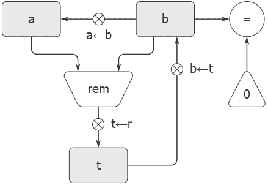

# 5.1设计套准机

> 译者： [https://sicp.comp.nus.edu.sg/chapters/95](https://sicp.comp.nus.edu.sg/chapters/95)


要设计寄存器机器，我们必须设计其_数据路径_（寄存器和操作）以及对这些操作进行排序的_控制器_。 为了说明简单的寄存器机的设计，让我们检查一下Euclid算法，该算法用于计算两个整数的最大公约数（GCD）。 正如我们在 [1.2.5](16) 部分中所看到的，欧几里得算法可以通过迭代过程执行，如以下函数所指定：

```js
function gcd(a, b) {
    return b === 0 ? a : gcd(b, a % b);
}
```

执行此算法的机器必须跟踪两个数字和，因此让我们假定这些数字存储在两个具有这些名称的寄存器中。 所需的基本操作是测试寄存器`b`的内容是否为零，以及计算寄存器`a`的剩余内容除以寄存器`b`的内容。 余数运算是一个复杂的过程，但是现在假设我们拥有一个计算余数的原始设备。 在GCD算法的每个循环中，必须将寄存器`a`的内容替换为寄存器`b`的内容，并将`b`的内容替换为`a`的旧内容除以 `b`的旧内容。 如果可以同时进行这些替换将很方便，但是在我们的寄存器机器模型中，我们将假设在每个步骤中只能为一个寄存器分配一个新值。 为了完成替换，我们的机器将使用第三个&lt;quote&gt;临时&lt;/quote&gt;寄存器，我们将其称为`t`。 （首先将剩余部分放置在`t`中，然后将`b`的内容放置在`a`中，最后将存储在`t`中的其余部分放置在`b`中。）

我们可以使用图 [5.1](95#fig_5.1)的源值将&lt;/quote&gt;流入指定的寄存器。 每个按钮旁边的标签是我们将用来指代按钮的名称。 名称是任意的，可以选择具有助记符的值（例如`a&lt;-b`表示按下将寄存器`b`的内容分配给寄存器`a`的按钮）。 寄存器的数据源可以是另一个寄存器（如`a&lt;-b`赋值），运算结果（如`t&lt;-r`赋值）或常数（无法更改的内置值），表示为 数据路径图（包含常数的三角形）。

根据常数和寄存器内容计算值的运算在数据路径图中由梯形表示，该梯形包含该运算的名称。 例如，在图 [5.1](95#fig_5.1) 中标有`rem`的框表示计算与其连接的寄存器`a`和`b`的其余内容的操作。 箭头（无按钮）从输入寄存器和常量指向该框，箭头将操作的输出值连接到寄存器。 测试由包含测试名称的圆圈表示。 例如，我们的GCD机器有一个测试寄存器`b`的内容是否为零的操作。 测试还具有来自其输入寄存器和常量的箭头，但没有输出箭头。 它的值由控制器而不是数据路径使用。 总体而言，数据路径图显示了机器所需的寄存器和操作以及它们如何连接。 如果我们将箭头视为导线，将`X`按钮视为开关，则数据路径图非常类似于可以由电气组件构造的机器的接线图。

<figure>**[图5.1](95#fig_5.1)** GCD机器的数据路径。</figure>

为了使数据路径实际计算GCD，必须按正确的顺序按下按钮。 我们将根据控制器图描述此序列，如图 [5.2](95#fig_5.2) 所示。 控制器图中的元素指示如何操作数据路径组件。 控制器图中的矩形框标识要按下的数据路径按钮，箭头描述从一个步骤到下一个步骤的顺序。 图中的菱形代表决策。 根据菱形中标识的数据路径测试的值，将遵循两个排序箭头之一。 我们可以根据物理类比来解释控制器：将图视为迷宫状的大理石。 当大理石弹入一个盒子时，它会按下由盒子命名的数据路径按钮。 当大理石弹入决策节点（例如`b` 的测试）时，它将大理石节点留在由指示测试结果确定的路径上。 总而言之，数据路径和控制器完全描述了用于计算GCD的机器。 将数字放入寄存器`a`和`b`后，我们在标记为`start`的位置启动控制器（滚动大理石）。 当控制器达到`done`时，我们将在寄存器`a`中找到GCD的值。 [图5]

<figure>**[图5.2](95#fig_5.2)** GCD机器的控制器。</figure>

<exercise>Design a register machine to compute factorials using the iterative algorithm specified by the following function. Draw data-path and controller diagrams for this machine.

```js
function factorial(n) {
    function iter(product, counter) {
        return counter > n 
               ? product
               : iter(counter * product,
                      counter + 1);
   }
   return iter(1, 1);
}
```

<button class="btn btn-secondary solution_btn" data-toggle="collapse" href="#no_solution_95_1_div">Add solution</button>There is currently no solution available for this exercise. This textbook adaptation is a community effort. Do consider contributing by providing a solution for this exercise, using a Pull Request in [Github](https://github.com/source-academy/sicp).</exercise>